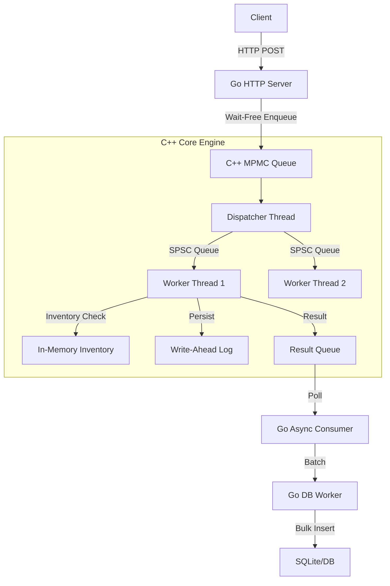

# High-Performance Hybrid Seckill Engine

A high-performance, crash-safe seckill (flash sale) engine built with **Go** (Interface Layer) and **C++** (Core Engine).

## Key Features

*   **Hybrid Architecture**: Go handles HTTP/Business Logic, C++ handles high-concurrency inventory processing.
*   **Extreme Performance**:
    *   **Lock-Free Queues**: Uses MPMC (Multi-Producer Multi-Consumer) and SPSC (Single-Producer Single-Consumer) queues for zero-lock communication.
    *   **Async Processing**: Decouples request ingestion from DB persistence.
    *   **Throughput**: Capable of handling **20k+ TPS** on a single node (Benchmark: 500k requests in ~28s).
*   **Reliability**:
    *   **Zero Data Loss**: Graceful shutdown mechanism ensures all in-flight requests are processed and persisted.
    *   **Crash Recovery (WAL)**: Write-Ahead Logging (WAL) ensures data integrity even after `kill -9` or power failure.
    *   **Backpressure**: Adaptive flow control protects the system from overload (returns HTTP 429 when saturated).
*   **Observability**: Real-time metrics for queue depth, DB commit latency, and batch size.

## Architecture



## Design Decisions

### 1. Hybrid Go + C++
*   **Why?** Go provides a robust HTTP ecosystem (Gin) and productivity. C++ provides fine-grained control over memory and threads for the "hot path" (inventory decrement).
*   **Bridge**: CGO is used for crossing the boundary. To minimize CGO overhead, we use lock-free queues and batching.

### 2. Queue Strategy
*   **MPMC (Input)**: Handles concurrent requests from hundreds of Go goroutines.
*   **SPSC (Internal)**: Dispatcher distributes work to Workers via SPSC queues, ensuring **zero contention** on worker threads. This allows workers to run without locks (Single Writer Principle).

### 3. Persistence & Safety
*   **WAL**: Every inventory change is appended to a log file before processing. On restart, the engine replays the log to restore state.
*   **Two-Phase Shutdown**:
    1.  **Drain**: Stop accepting new inputs, wait for queues to empty.
    2.  **Verify**: Ensure `Input Count == Output Count == DB Committed Count`.
    3.  **Stop**: Safe to exit.

## Usage

### Build & Run
```bash
cd backend
go build -o backend_app .
./backend_app
```

### Benchmark
```bash
go run benchmark/bench.go
```
