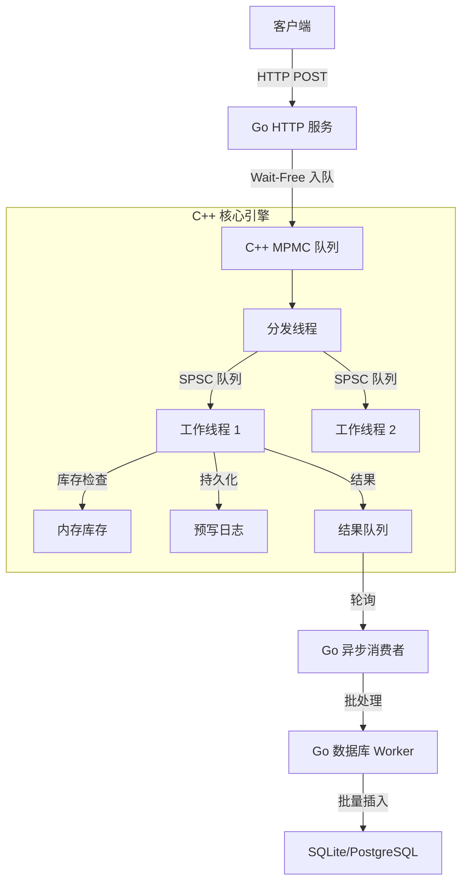

# 高性能混合架构秒杀引擎 (High-Performance Hybrid Seckill Engine)

[English](README.md) | [中文](README_zh-CN.md)

disclaimer: 本项目仅用于娱乐目的，不建议在生产环境中使用。小弟水平有限，此项目基本是面向AI编程(vibe coding)搞出来的，代码质量和可维护性均未得到保障。

一个基于 **Go** (接入层) 和 **C++** (核心引擎层) 构建的轻量级崩溃安全的秒杀系统。

## 核心特性

*   **混合架构 (Hybrid Architecture)**: Go 处理 HTTP 请求与业务逻辑，C++ 负责高并发的库存扣减。
*   **高性能 (High Performance)**:
    *   **无锁队列**: 使用 **Vyukov 的 MPMC** (多生产者多消费者) 和 **SPSC** (单生产者单消费者) 队列，实现零锁通信。
    *   **零竞争**: 采用 **Thread-per-Core** (每核一线程) 架构，最小化上下文切换和锁竞争。
    *   **高吞吐**: 单节点可处理 **20k+ TPS** (基准测试: 50 万请求仅需约 28 秒)。
*   **高可靠性 (Reliability)**:
    *   **零数据丢失**: 优雅退出机制确保所有在途请求都被处理并持久化。
    *   **崩溃恢复 (WAL)**: 预写日志 (Write-Ahead Logging) 确保即使在 `kill -9` 或断电后数据依然完整。
    *   **背压机制**: 自适应流量控制，保护系统免受过载影响。

## 架构设计



## 性能基准测试报告 (Benchmark Report)

基于 2026年2月3日 的最新实测数据。

**测试环境 (Test Environment):**
- **CPU**: AMD Ryzen 7 5800H (8核/16线程)
- **内存**: 32GB DDR4
- **架构**: Docker 容器化部署 (App + Redis + SQLite)
- **网络**: Localhost (Loopback)

### 1. 高并发秒杀场景 (High Concurrency)
模拟真实的秒杀流量，包含大量超卖（库存不足）请求。
- **配置**: 200,000 请求 | 1,000 并发 | 5,000 库存
- **吞吐量 (RPS)**: **~21,786 req/s**
- **HTTP 响应延迟**:
  - **P50 (中位数)**: 43.21 ms
  - **P99 (尾部延迟)**: 78.93 ms
- **数据一致性**: **100%** (0 错误, 0 超卖)
- **处理结果**: 4,900 成功入队, 195,100 秒杀失败 (Sold Out)

### 2. 低延迟纯入队测试 (Low Latency)
模拟库存充足时的快速下单场景。
- **配置**: 5,000 请求 | 100 并发 | 库存充足
- **HTTP P50 延迟**: **8.48 ms**
- **HTTP P99 延迟**: 40.77 ms

### 3. 核心引擎微秒级延迟 (Internal Latency)
得益于无锁队列设计，C++ 核心处理极为迅速，瓶颈主要在网络 IO。
- **MPMC Queue (入队 -> 分发)**: **~341 µs** (0.34 ms)
- **SPSC Queue (分发 -> 执行)**: **~54 µs** (0.05 ms)
- **结论**: 核心排队延迟 < 0.5ms，证明了混合架构在计算密集型任务上的绝对优势。

### 4. 数据库批处理 (Database Batching)
- **策略**: 异步批量写入 (Asynchronous Batch Writes)
- **效果**: 平均批次大小 **~233 items**，最大 **1000 items**。
- **影响**: 将 20,000 次 DB I/O 压缩为 ~85 次批量插入。

### 5. PostgreSQL 高并发与混合场景测试
**测试环境**: 同上，但数据库切换为 **PostgreSQL 15** (Docker)。

#### 5.1 单品秒杀 (Single SKU)
- **吞吐量 (RPS)**: **~21,222 req/s** (与 SQLite 持平，受限于网络/Redis)
- **延迟**: P50 43.80ms | P99 94.47ms
- **DB 性能**: 平均批处理延迟 **~21ms** (由于网络往返，比嵌入式 SQLite 慢)

#### 5.2 多品类混合负载 (Mixed Workload: Hot/Cold SKUs)
模拟 8 个不同热度的商品同时秒杀。
- **配置**: 400,000 请求 | 8 SKUs (5,000 库存/SKU) | 1,000 并发
- **吞吐量 (RPS)**: **~13,581 req/s**
- **延迟**: P50 61.81ms | P99 183.64ms
- **瓶颈分析**: SPSC 队列延迟上升至 ~419ms。这表明 **PostgreSQL 的写入速度成为瓶颈**，反压导致工作线程处理变慢。系统通过背压机制成功削峰，未发生崩溃或数据丢失。

## 深度解析：核心技术

### 1. 线程模型与 SMT 优化
摒弃了通用的线程池，转而采用 **Thread-per-Core** 模型。

*   **物理核心 vs 逻辑核心**:
    *   **C++ 核心 (热路径)**: 我们为库存引擎分配固定数量的 Worker（例如 4 个线程）。这些线程被设计为占用**独立的物理核心**，避免了 SMT（超线程）带来的资源争抢（ALU/FPU/L1 缓存）。
    *   **Go 运行时 (IO 路径)**: 剩余的逻辑线程（例如 12 个线程）留给 Go 运行时处理 HTTP 解析、JSON 编码和数据库 IO。这利用了 SMT 来隐藏 IO 延迟，且不会污染核心引擎的 CPU 缓存。
*   **自旋与退避 (Spinning & Backoff)**: Worker 线程使用精细的 **Backoff 策略** (pause 指令 -> yield)，而不是立即休眠。这保持了 CPU 流水线的“热度”，避免了微突发流量期间昂贵的内核态上下文切换。

### 2. 零分配内存策略 (Zero-Allocation)
为了消除 GC 停顿和分配器开销，我们实施了严格的 **"循环内无 New (No-New-in-Loop)"** 策略。

*   **预分配环形缓冲区**: 所有队列 (MPMC/SPSC) 在启动时一次性申请全部内存。请求在这些固定的内存区域中流动，永远不会触发 `malloc` 或 `free`。
*   **栈上批处理 (Stack Batching)**: Worker 在 **CPU 栈** 上批量处理请求（例如每次 64 个）。这确保了极佳的数据局部性，且无堆内存碎片。
*   **切片复用 (Go)**: Go 端的消费者复用底层切片数组 (`batch = batch[:0]`)，最小化 Go 垃圾回收器的压力。

### 3. 高级排队论：漏斗模型 (The Funnel Model)
结合了两种类型的无锁队列，以兼得二者之长：

*   **第一级: MPMC (漏斗)**
    *   **角色**: 快速接收来自数百个并发 Go Goroutine 的请求。
    *   **技术**: 基于 **Vyukov 的 Bounded MPMC**。使用 `CAS` (比较并交换) 操作序列号。
    *   **优化**: 大量使用 **Cache Line Padding** (缓存行填充)，防止不同 CPU 核心上的 `head` 和 `tail` 指针发生 *伪共享 (False Sharing)*。

*   **第二级: SPSC (管道)**
    *   **角色**: 将任务从分发器 (Dispatcher) 分发到特定的 Worker (按 SKU 分片)。
    *   **技术**: **Wait-Free 环形缓冲区**。由于只有一个写入者和一个读取者，**完全消除了 CAS**。同步仅依赖于内存屏障 (`acquire`/`release` 语义)。
    *   **收益**: 这提供了线程间通信延迟的理论极限。

## 设计决策

### 为什么选择 Go + C++ 混合？
*   **Go**: 利用其丰富的生态系统 (Gin, GORM) 处理 HTTP 协议、JSON 解析和数据库连接等。
*   **C++**: 提供 <10µs 延迟库存检查所需的裸指针操作、手动内存管理和线程亲和性控制。
*   **桥接**: 使用 `cgo`，但通过批量请求和无锁共享内存队列来最大限度地减少跨语言边界的开销。

### 持久化与安全
*   **WAL (预写日志)**: 模仿数据库的日志机制。每次库存扣减在更新内存之前都会先追加到文件 (`O_APPEND`)。
*   **崩溃恢复**: 启动时，引擎重放 WAL 以重建精确的内存状态。
*   **两阶段关闭**:
    1.  **排空 (Drain)**: 停止接受新输入。
    2.  **验证 (Verify)**: 等待 `输入数 == 输出数`。
    3.  **停止 (Stop)**: 安全退出进程。

### Nginx 与多节点分流测试
我们在测试环境中引入 Nginx，核心目的是为了验证**多机部署 (Multi-Node)** 场景下的流量分发与系统行为。
*   **水平扩展验证**: 通过 Nginx 将流量分发到多个 Backend 实例，观察系统在集群模式下的吞吐量线性增长情况。
*   **分流策略**: 模拟负载均衡（Load Balancing），确保请求能够均匀或按策略（如 IP Hash）路由到不同的计算节点，以验证无状态接入层设计的正确性。

## 快速开始 (Quick Start)

假设你刚刚 Clone 了本项目，请按照以下步骤启动并测试。

### 1. 启动基础设施
使用 Docker Compose 一键启动 Redis 和 PostgreSQL。

```bash
docker-compose up -d
```
*这将启动 Redis (端口 6380) 和 PostgreSQL (端口 5432)。*

### 2. 编译后端服务
进入 `backend` 目录并编译。注意本项目使用了 CGO (C++ 混合编程)，确保你的环境支持 CGO (Linux/Mac 默认支持，Windows 需要 MinGW)。

```bash
cd backend
go mod tidy
go build -o server .
```

### 3. 运行服务
您可以选择使用 SQLite (默认) 或 PostgreSQL 启动服务。

**选项 A: 使用 SQLite**
```bash
./server
```

**选项 B: 使用 PostgreSQL**
```bash
# 确保 docker 容器已启动
USE_PG=true ./server
```
*服务启动后将在 `:3000` 端口监听。

### 4. 运行基准测试
保持服务运行，打开一个新的终端窗口，进入测试目录运行压测脚本。

```bash
cd backend/tests

# 运行高并发压测 (20万请求，1000并发)
go run benchmark_high_concurrency.go

# 运行混合负载压测 (模拟真实场景)
go run benchmark_multi_sku.go
```

---

## 项目结构

## 关于前端

开发中。
