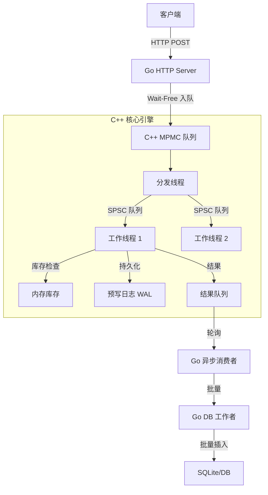

# 高性能混合架构秒杀系统引擎

这是一个使用 **Go** (接口层) 和 **C++** (核心引擎) 构建的高性能、崩溃安全（Crash-Safe）的秒杀系统 (Sec Kill) 引擎。

## 核心特性

*   **混合架构**: Go 处理 HTTP 请求和业务逻辑，C++ 处理高并发库存扣减。
*   **性能优化**:
    *   **无锁队列**: 使用 MPMC (多生产者多消费者) 和 SPSC (单生产者单消费者) 队列实现零锁通信。
    *   **异步处理**: 将请求接收与数据库持久化解耦。
    *   **吞吐量**: 单节点可处理 **20k+ TPS** (基准测试: 500k 请求在 ~28s 内完成)。
*   **可靠性**:
    *   **零数据丢失**: 优雅退出机制确保所有在途请求都被处理并持久化。
    * **WAL (Write-Ahead Logging)**:
        * 所有返回 202 的请求都会先写入 WAL
        * 系统崩溃或 kill -9 后，重启将通过 WAL 重放恢复所有已持久化请求
        * 恢复过程具备幂等性，避免重复写入
    *   **背压 (Backpressure)**: 自适应流量控制保护系统免受过载影响 (饱和时返回 HTTP 429)。
*   **可观测性**: 实时监控队列深度、数据库提交延迟和批处理大小。

* **吞吐能力**:
    * 单节点稳态吞吐：**~18k–20k RPS**（50 并发）
    * 在慢数据库/过载场景下，系统通过背压返回 429，而非堆积内存


### 请求语义保证 (Request Semantics)

- **HTTP 202 (Accepted)**  
  表示请求已被持久化（WAL durable），并保证最终落库。  
  在系统崩溃、kill -9、重启后，该请求不会丢失。

- **HTTP 429 (Too Many Requests)**  
  表示系统已达到处理能力上限，请求未被接受，也不会进入 WAL。  
  客户端应执行退避重试。

系统保证：**最终数据库中的订单数 == 所有返回 202 的请求数**。


## 架构图



## 设计决策

### 1. 混合 Go + C++
*   **为什么?** Go 提供了强大的 HTTP 生态系统 (Gin) 和开发效率。C++ 为“热路径” (库存扣减) 提供了对内存和线程的细粒度控制。
*   **桥接**: 使用 CGO 跨越边界。为了最小化 CGO 开销，我们使用了无锁队列和批处理。

### 2. 队列策略
*   **MPMC (输入)**: 处理来自数百个 Go goroutine 的并发请求。
*   **SPSC (内部)**: Dispatcher 通过 SPSC 队列将任务分发给 Worker，确保工作线程上 **零竞争**。这允许 Worker 在无锁状态下运行 (单写入者原则)。
> 早期版本曾错误地在多生产者场景下使用 SPSC 队列，
> 导致指针竞争、数据覆盖和偶发丢单。
> 当前架构通过 MPMC → SPSC 的拓扑修复了并发语义错配问题。


### 3. 持久化与安全
*   **WAL**: 每次库存变更在处理前都会追加到日志文件中。重启时，引擎会重放日志以恢复状态。
*   **两阶段停止**:
    1.  **排空 (Drain)**: 停止接受新输入，等待队列清空。
    2.  **验证**: 确保 `输入数量 == 输出数量 == DB 提交数量`。
    3.  **停止**: 安全退出。

## 使用方法

### 构建与运行
```bash
cd backend
go build -o backend_app .
./backend_app
```

### 基准测试
```bash
go run benchmark/bench.go
```

### 检查数据库
```bash
go run tools/check_db/main.go
```

## 关于前端

Under developing

